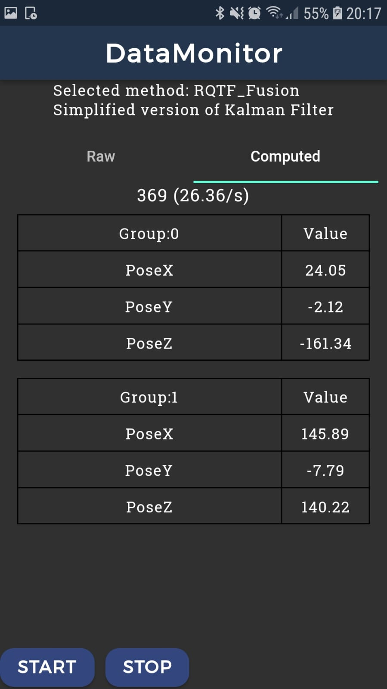
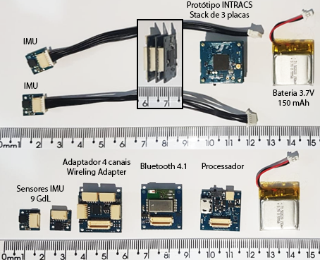
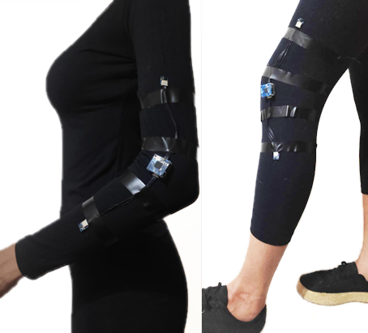

**INTRACS** - **In**ertial **Tra**cker **Com**puting **S**ystem

INTRACS is a software made to ease the process of gathering raw data from inertial sensors wirelessly, and make use of them through a computing method (algorithm - e.g. sensor fusion) to output the transformed raw data. It's structured following the guidelines of clean architecture along with some layers and components customizations to achieve the range of functionality needed. 

As of now, the provided app is capable of gathering and computing raw data coming via Bluetooth from a custom inertial unit made with Arduino SAM architecture. The inertial device prototype presented is assembled with a custom 3rd party (TinyCircuits) hardware, made with an Atmel SAMD21 32-bit ARM Cortex M0+ processor. It has the potential to support 32 9-Axis IMUs (eight stacked Wireling Adapters with four 9Axis Wirelings each adapter), sending the data via Bluetooth through a simple byte structure. It's also meant to be open-source and low-cost compared to the market alternatives. 

## Documentation

* [Setup and Configuration](docs/GET_STARTED.md)
* [Project Architecture](docs/PROJECT_ARCHITECTURE.md)
* [Contributing to INTRACS](docs/CONTRIBUTING.md)
* [Getting help](docs/SUPPORT.md)
* [Be nice to everyone](docs/CODE_OF_CONDUCT.md)

## The application

 

The images above show the collected raw data from two 9 axis sensors being shown on the screen as long as the computed data, the computing method applied is a sensor fusion called RTQF, a simplified version of Kalman Filter using quaternions, from RTIMU library (richards-tech).

## The inertial device

The image above shows the inertial device that was assembled using TinyCircuits boards with the wirelings platform. There are one processor board, one Bluetooth 4.1 board, one wireling adapter board with 4 channels, two wireling 9 axis IMU, cables, and a 150mAh battery.

## Possible applications

Due to its small size and portability, one could use this to develop smart vests to capture and process inertial data related to human kinematics, like elbow or knee movements, gait analysis, etc.

