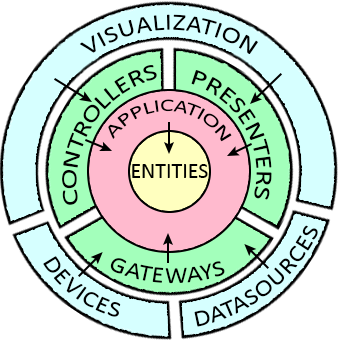
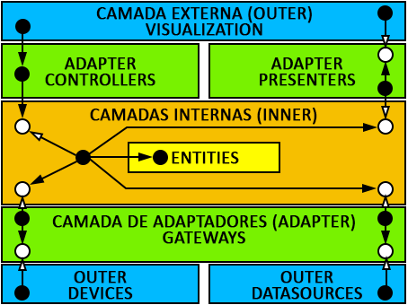
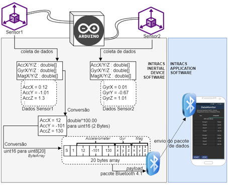

# INTRACS Project Architecture

This project is composed of two softwares, the multiplatform mobile application and the inertial data device transmitter. The mobile app is the complex one for now, as the device is only meant to gather and transmit the raw inertial data through bluetooth.

# INTRACS Software

The app project was made following the guidelines of Uncle Bob's Clean Architecture and programming patterns and principles like GRASP, GoF and SOLID. The onion visualization of clean architecture of this project is shown below, it's composed of 3 outer layers, 3 adapter layers, and 2 inner layers.

The arrows between the layers represents dependency, and dependency means that one object at the start of the arrow depends on (uses an) object at the end of the arrow. In clean architecture this is the dependency rule, and must be preserved throughout the different layers of the architecture. The dependency rule states that no inner layer should depend on an outside layer, which means that the components inside a layer should only have dependency pointing inwards the architecture, not outwards.

In the image above, you can see a different layout of the architecture, the solid black dots represents concrete classes and the white dots represents abstract classes. Both of the arrows represents dependency, the black one you can read as *"use"* and the white one you can read as *"implements"*.

As you can see there are many *dots* inside each different layer in order to preserve the dependency rule, each of those dots represents a component inside the given layer. There are many different components, lets start from inside out.

# INTRACS - Inner Layers

## Inner Layer - Entities

The entities layer exists to represent business rules and can be viewed as structured model of the business, which defines different entities, relation between entities and rules and functions of them. The entities classes made by the effort of trying to bring the outside world problem (reality) into code, they can be seen as the highest tier of abstraction of rules.There is still no concept of application inside this layer, because these concepts lies on the next layer, the application layer.

## Inner Layer - Application

When business rules starts to merge with the techinicality of an application, the responsibility for these rules falls over components of this layer. The major components of this layer are the use cases, they are a simple representation of an automated process, receiving an input, maybe fetching some data from outside, doing some manipulation with this input and the Entities, and by the end, calling an output.

The input port of the use case is defined by his abstract class with an InputDTO (Data Transfer Object), this guarantees that an external object calling this abstract class must pass the input object as parameter. The use case can decide to fetch data outside, for this it can define an abstract class called DataAccess and use the abstraction, the next layer will take care of implement that. It can also use Entities to work with, and at the end it will produce a result, this result will be thrown as a parameter of the output port. The output port is another abstraction with another OutputDTO, the next layer will take care of implement that.

As you can see, many of the responsibilities of a *"use case"* was taken away and given to the next layers. Things like fetching data from databases, showing information on the screen and managing the input parameter correctly doesn't exists here, the use case can produce errors/exceptions based on the input of course, but that belongs to the application rules it was designed for.

Since all those responsibilites are given to outer components through dependency inversion, the next set of layers, called Adapters, must have components that implements those abstractions to follow its the definitions.

# INTRACS - Adapter Layers

## Adapter Layer - Controllers

This layer contains only one major component, the controllers, they are responsible to know and call the right use case, or use cases. The Controller here is meant to be different than the controller from other architectures like MVC (Model-View-Controller), it's role is designed to be small and precise, this gives high cohesion to these components and avoid the creation of the worse that usually happens in other architectures, God Controllers.

Since the input flow of architecture is cut in 3 different parts, being the use cases the central role of it, you can give controllers more responsibility, like managing some degree of input validation. We believe this is a project decision that sets the line between who (visualization, controller or use case) is accountable for different kinds of validation.

## Adapter Layer - Gateways

On the other side of the adapter layer, there are gateways. The gateways are meant to provide the communication between the use cases and external sources. In this architecture, these external sources can be Devices or DataSources.

Now, when an use case asks for data to an abstract `DataAccess` object, this abstract object will be replaced with a concrete instance of one of its implementation, which is the `Repository`. The Repository role is to fulfill the methods set by the DataAccess knowing the Source required to do so. 

In order to keep in check with the dependency rule, the dependency inversion must be applied here too, so the `Source` objects are abstract and meant to be implemented on the outer layer devices or datasources. 

## Adapter Layer - Presenters

When the use case finishes its job, it has to produce a result and call an output port with that, be it an `Exception` or a `Success<T>`. The `UseCaseOutput` is an abstract class that is implemented by a `Presenter` in this layer. The presenter role is to format and show the data in a most convenient way to outer layer, as an example, this means that the use case is not responsible for formatting money, but you could format it here if you wanted to.

And again, in order to not break the dependency rule, another dependency inversion must be applied. The `Presenter` will format the data coming from the use case in a data structure called `ViewModel` and then call the `View` to show this structure to the user. The `View` is an abstract object that is implemented in the outer layer visualization, where the flutter app exists.

# INTRACS - Outer layers
## Outer Layer - Visualization

The visualization layer is where the Flutter app lies, it's the layer that has the larger amount of external dependencies, like frameworks, libraries, etc. The Flutter app is designed to call the controllers from the adapters when needed and received the result from the presenters through the implementation of the views.

This is a quite unconventional flow of control since calling a method won't produce the result as a return statement from the same call, but instead of that, from other object, the one that implements the `View` from the adapter layer.

The implementations of the `View` classes are called `Display` here, and most of the page controllers have a reference to it and also to the `Controller` from the adapter layer, which is used to trigger the input action.

## Outer Layer - Devices

This layer makes possible the communication with external devices, in this project, it enables communication between the application and the bluetooth from the smartphone and also the bluetooth from the inertial device.

All the bluetooth communication is made through this channel, so the use case doesn't care about which technology is being used to list or connect to the devices available, the use cases just asks for the stuff, the details are not relevant there, but here it is.

So if you were wondering the entry point of the inertial data being sent by the inertial device, yeah, all the raw data messages containing the inertial data are received through here.

## Outer Layer - DataSources

Along with the devices layer, also neighboring the gateway layer, the DataSources outer layer is responsible to provide data, there is a HiveDB implementation here as a NoSQL datasource, but its not being used so much and can be used while adding new features.

Other than that, the crucial functionality of this project is here too, the computing methods are implemented here and they are the ones who input the `ComputedData` in the architecture, and with the blessings of OOP and Dependency Inversion, this data reach the screen of the app.

# INTRACS Device 

## Inertial BLE Transmitter

This project is built using TinyCircuits boards and it's really simple to buy and assemble its pieces. The software deployed into the arduino processor board is really simple and it's meant to just collect the data from the multiple inertial sensors and send then through bluetooth in a sequential order.

In order to send the data through Bluetooth, the data must be converted to a data package (payload) of 20 bytes, this is a limitation of the technology (BLE 4.1) and can be replaced in the future. The image below shows how the software collects and sends the data.

