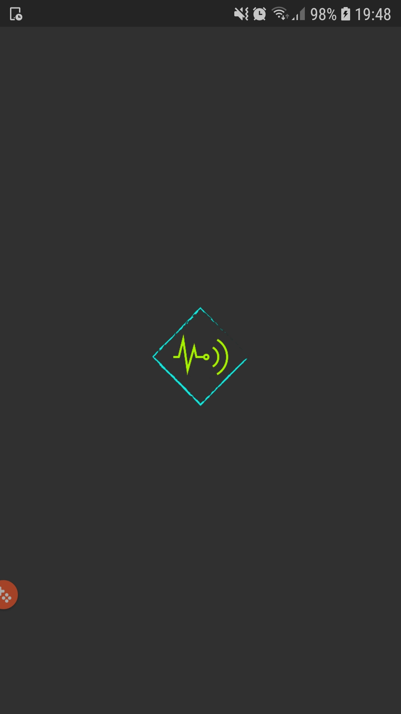
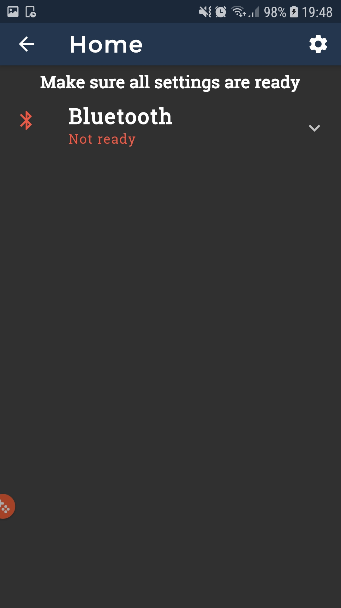
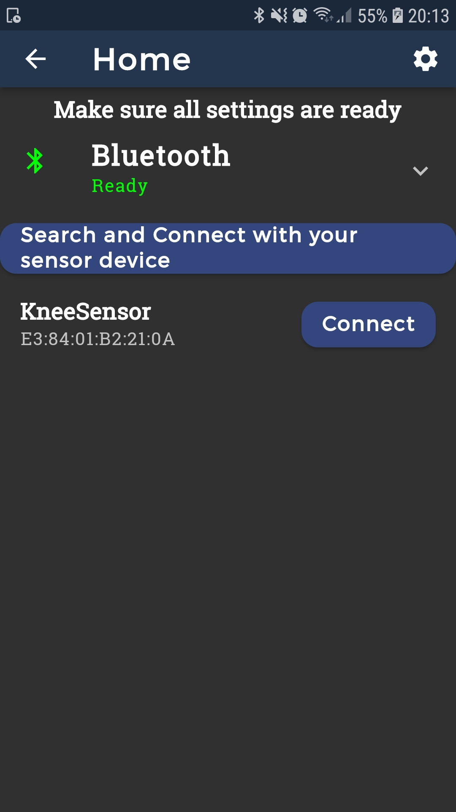
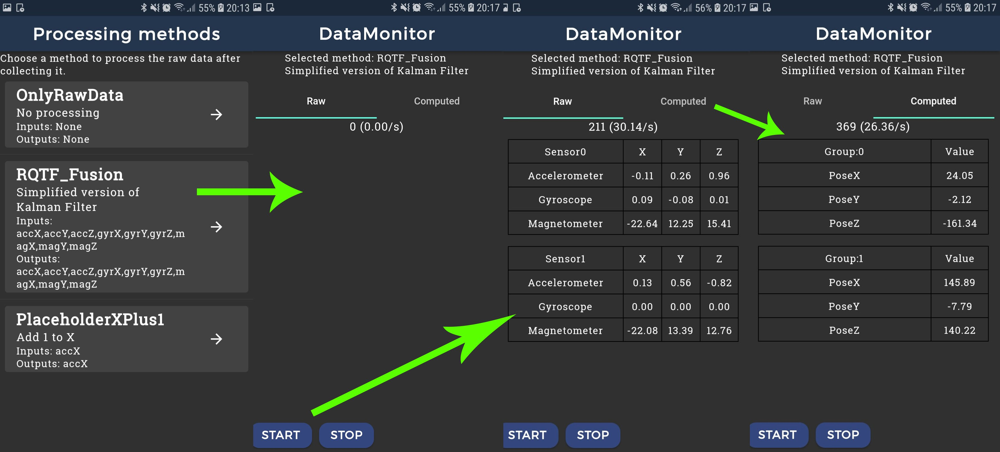

# INTRACS Software

This project folder contains all the different layers and components that puts the INTRACS functionalities together. The details about each one is detailed in the [Project Architecture](../docs/PROJECT_ARCHITECTURE.md) document. 

As of now, the application is pretty simple, it's composed of 13 different use cases that let the user to select a computing method and see the inertial raw data and computed that on the app screen. In order, the user will first start up the app and land in the Bluetooth screen to turn it on, this will trigger the TransmissionState use cases, after that it will select a Bluetooth inertial device to connect.

The use cases related to that are the Devices use cases. Following the device connection, the user will see a list and select a computing method, those are the computing use cases. And at the end the user will decide when to start and stop the gathering and computing of raw data.

